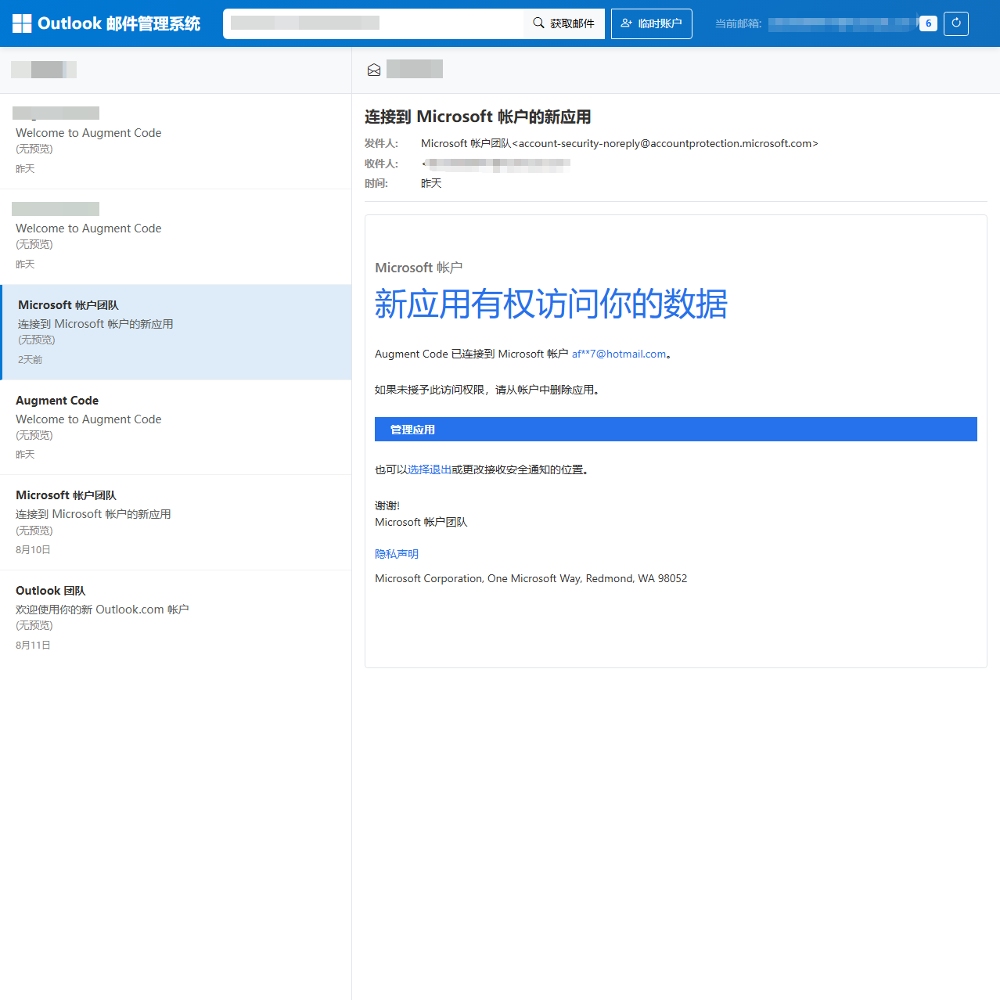
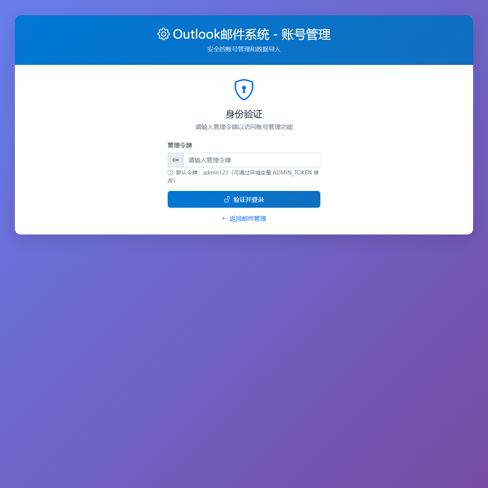
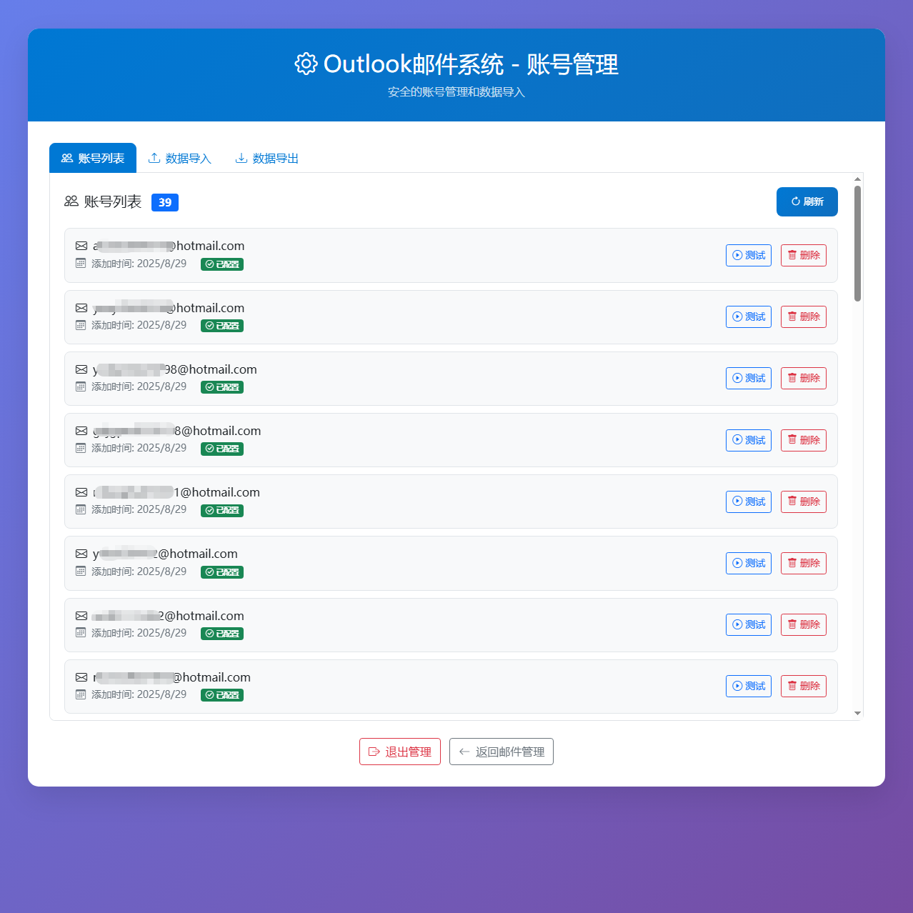

# Outlook 邮件管理系统

基于 FastAPI 的 Outlook 邮件系统，支持多账户管理和邮件获取，支持移动端显示，支持批量导入导出以及账号测试。








## 目录结构

```
.
├── static/                 # 前端静态文件
│   ├── admin.html          # 管理页面
│   ├── admin.js            # 管理页面脚本
│   ├── index.html          # 主页面
│   ├── script.js           # 主页面脚本
│   └── style.css           # 样式文件
├── config.txt              # 邮箱账户配置文件
├── .env.example            # 环境变量配置示例文件
├── mail_api.py             # 主程序文件
├── get_refresh_token.py    # 获取刷新令牌工具
├── requirements.txt        # Python依赖包
├── Dockerfile              # Docker镜像构建文件
├── docker-compose.yml      # Docker容器编排配置
├── deploy.sh               # 自动化部署脚本
└── README.md               # 项目说明文档
```

## 配置文件

### config.txt 格式

```
# 批量邮箱账户配置文件
# 格式：用户名----密码----client_id----refresh_token
# 每行一个账户，用----分隔各字段
user@example.com----password123----your_client_id----refresh_token_here
```

**重要说明：**
- 每行代表一个邮箱账户
- 字段间使用四个连字符 `----` 分隔
- 支持注释行（以#开头）和空行
- 需要提前获取每个账户的 refresh_token

## 本地部署

### 1. 安装依赖

```bash
pip install -r requirements.txt
```

### 2. 配置邮箱账户

编辑 `config.txt` 文件，添加邮箱账户信息。

### 3. 启动服务

```bash
python mail_api.py web
```

访问 http://localhost:5000 查看前端界面。

## Docker 部署

### 使用 docker-compose（推荐）

```bash
# 构建并启动服务
docker-compose up -d

# 查看服务状态
docker-compose ps

# 查看日志
docker-compose logs -f

# 停止服务
docker-compose down
```

### 使用自动化部署脚本

```bash
# 赋予执行权限
chmod +x deploy.sh

# 构建镜像
./deploy.sh build

# 启动服务
./deploy.sh start

# 查看状态
./deploy.sh status

# 查看日志
./deploy.sh logs

# 停止服务
./deploy.sh stop
```

## 使用方法

### Web 界面（推荐）

1. 打开浏览器访问：http://localhost:5000
2. 输入邮箱地址，点击"获取邮件"按钮
3. 查看邮件列表，点击邮件查看详情

### 管理界面

1. 访问：http://localhost:5000/admin
2. 输入管理令牌（默认：admin123）
3. 进行账户管理、批量导入导出等操作

### 临时账户（手动输入账号信息）

- 点击"临时账户"按钮
- 输入临时邮箱凭据
- 无需修改配置文件即可测试

## 环境变量

项目支持通过环境变量进行配置，可以复制 `.env.example` 文件为 `.env` 并修改相应配置：

| 变量名 | 说明 | 默认值 |
|--------|------|--------|
| ADMIN_TOKEN | 管理页面访问令牌 | admin123 |
| SERVER_PORT | 服务器端口 | 5000 |
| SERVER_HOST | 服务器主机地址 | 0.0.0.0 |
| TZ | 时区设置 | Asia/Shanghai |
| LOG_LEVEL | 日志级别（DEBUG, INFO, WARNING, ERROR, CRITICAL） | INFO |
| VERBOSE_LOGGING | 是否启用详细日志 | false |

## 注意事项
- 仅能获取config中配置的邮件，否则会提示网络错误
- 默认获取最近 5 封邮件
- 管理页面需要令牌认证
- 临时账户信息仅保存在浏览器会话中
- 确保 config.txt 文件安全，包含敏感信息